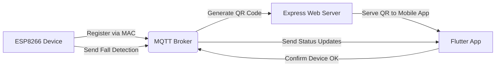

# FallWatcher

**FallWatcher** is a complete IoT-based system for detecting falls in real-time using ESP8266 devices, an MQTT broker, and a Flutter mobile application. The system is composed of the following components:

1. **ESP8266 Fall Detection Device**: Firmware running on ESP8266 devices that detects falls and registers with the MQTT broker.
2. **MQTT Broker (Node.js)**: A broker built using **Aedes** and **Node.js**, which manages the communication between devices and the Flutter app. It also generates a QR code for each device's MAC address when they register.
3. **Web Server (Express)**: Serves the generated QR code that contains the device's MAC address so it can be scanned and registered in the Flutter app.
4. **Flutter Mobile Application**: A mobile app that allows users to receive fall detection notifications, manage the devices, and confirm their status.

## System Components

### 1. **ESP8266 Fall Detection Device**
- The ESP8266 devices are responsible for detecting falls using sensors like an accelerometer.
- When a device detects a fall, it sends a message to the MQTT broker.
- When a device registers with the broker, the MAC address is used to generate a QR code, which can be scanned by the mobile app.
- The firmware is located in the `esp8266/` directory.

### 2. **MQTT Broker (Node.js)**
- Built using **Aedes**, a lightweight MQTT broker, the MQTT broker handles all messages between the ESP8266 devices and the Flutter app.
- It listens for device registration on the topic `devices/register`.
- Upon receiving a registration message with the device’s MAC address, the broker generates a QR code that represents the MAC address and stores it.
- The broker runs on port `1883`.

### 3. **Express Web Server (Node.js)**
- The **Express server** is responsible for serving the QR codes generated by the MQTT broker.
- It exposes a route `/qrcode/:mac`, where `:mac` is the MAC address of the device.
- The mobile app scans this QR code to register the device and start receiving fall detection notifications.
- The server is configured to run on port `80` by default.

### 4. **Flutter Mobile Application**
- The **Flutter app** displays the list of devices, shows notifications when a fall is detected, and allows the user to confirm that the device is OK after a fall.
- Devices are added by scanning the QR code generated by the MQTT broker.
- The app subscribes to MQTT topics to receive real-time updates about the status of each device.

## System Architecture

The following diagram illustrates how the system components interact with each other:



### System Flow

1. **Device Registration**: When a new device (ESP8266) powers up, it sends its MAC address to the MQTT broker using the topic `devices/register`.
2. **QR Code Generation**: The broker generates a QR code using the MAC address and stores it.
3. **QR Code Scanning**: The Express server serves the QR code, and the user can scan it with the Flutter app to register the device.
4. **Fall Detection**: When a device detects a fall, it sends a message to the broker, which forwards the information to the Flutter app. The app displays a notification to the user.
5. **Acknowledge Status**: The user can confirm the status of the device in the app, and the confirmation is sent back to the MQTT broker.

## Setup Instructions

### 1. ESP8266 Fall Detection Device
1. Navigate to the `esp8266/` folder to access the device firmware.
2. Flash the firmware to the ESP8266 devices.
3. Configure the Wi-Fi credentials and the MQTT broker IP in the firmware.
4. The device will send its MAC address to the broker when it starts.

### 2. MQTT Broker Setup
1. Navigate to the `mqtt-server/` directory.
2. Install the dependencies:

   ```bash
   npm install
   ```

3. Start the MQTT broker:

   ```bash
   node index.js
   ```

4. The MQTT broker will now run on port `1883` and listen for device registrations and fall detection messages.

### 3. Web Server Setup
1. The web server is also part of the `mqtt-server/` folder.
2. It will start automatically when you run the `node index.js` command.
3. The server will be available at `http://localhost:80` and serve QR codes at the route `/qrcode/:mac`.

### 4. Flutter Mobile Application Setup
1. Navigate to the `fallwatcherapp/` folder.
2. Install the Flutter dependencies:

   ```bash
   flutter pub get
   ```

3. Configure the MQTT broker IP in `mqtt_service.dart`:

   ```dart
   static final MqttServerClient client = MqttServerClient('', '');
   ```

   Replace with the actual IP address of your broker.

4. Run the app:

   ```bash
   flutter run
   ```

## MQTT Configuration

The ESP8266 devices register with the broker using the topic:

```
devices/register
```

The broker listens on port `1883` for incoming messages. When a fall is detected, the device sends a message to the topic:

```
nodemcu/{device_mac}/fall
```

The mobile app subscribes to this topic to receive real-time updates and display fall detection notifications.

## Flutter App Pattern

The Flutter app uses the **Bloc/Cubit pattern** for managing the app’s state. Here is a breakdown of the architecture:
- **Cubit**: The Cubits handle the state of the device list, device status updates, and fall detection notifications.
- **BlocBuilder**: The UI rebuilds based on the state changes managed by the Cubits.
- **MQTT Integration**: The app uses MQTT to receive messages about device statuses and fall detections in real time.

### Features:
- **Device Management**: Devices are added by scanning a QR code with the device’s MAC address.
- **Notifications**: The app notifies the user when a fall is detected by any device.
- **Acknowledge Fall**: The user can confirm that the device is OK after a fall is detected.

## License

This project is licensed under the GPL v3 License. See the [LICENSE](LICENSE) file for more details.